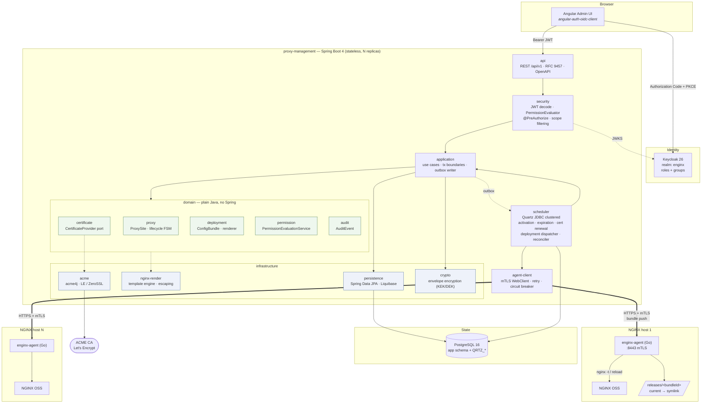
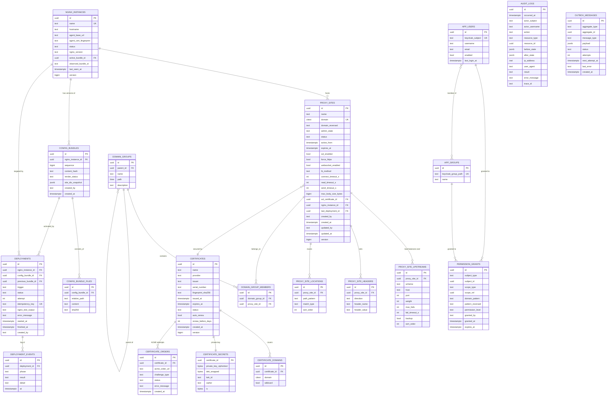
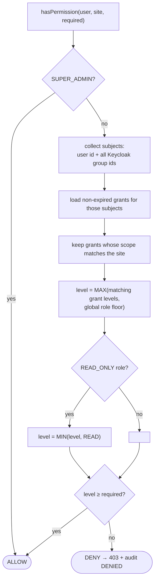
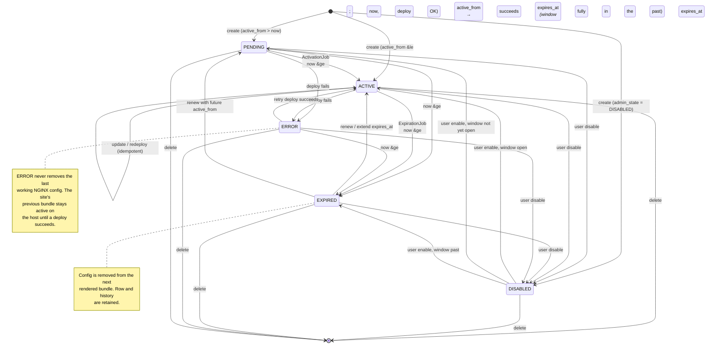
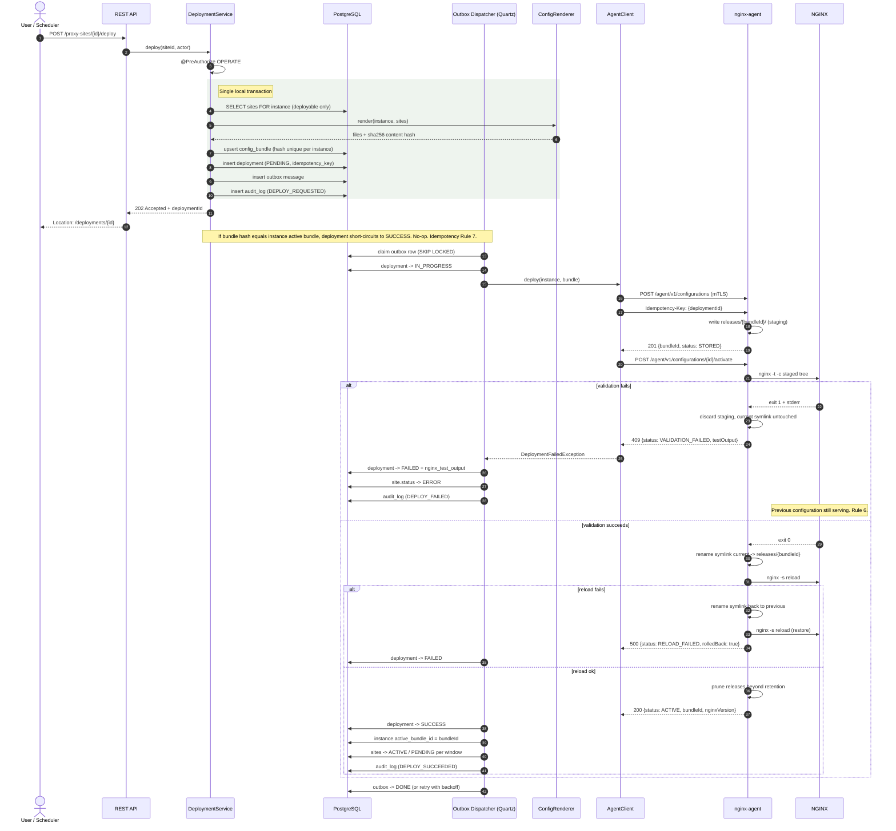
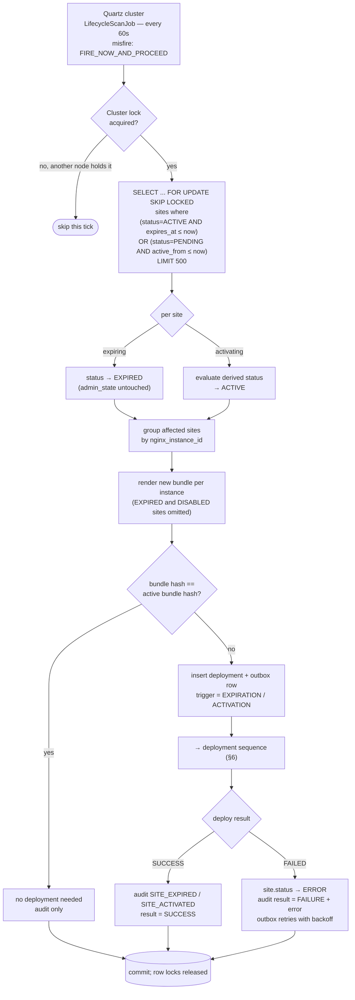

# Architecture

**Easy NGINX Admin** — an enterprise control plane for NGINX reverse proxies.

This is the design: what the components are, how they talk, and why each significant choice was
made. It describes the system as built. Where the implementation departed from the original
proposal, the departure and its reason are recorded in
[`implementation-notes.md`](implementation-notes.md) rather than edited into the design
as though it had always said so.

---

## 1. Overall Architecture

### 1.1 Shape of the system

Two deployable applications plus three infrastructure services. No microservices.

| Deployable | Language | Responsibility |
|---|---|---|
| `proxy-management` | Java 25 / Spring Boot 4 | Source of truth. Owns domain model, permissions, config rendering, deployment orchestration, scheduling, ACME. |
| `enginx-agent` | Go 1.22+ | One per NGINX host. Dumb, privileged executor: store bundle, `nginx -t`, atomic activate, reload, report status. |

Infrastructure: PostgreSQL 16, Keycloak 26, NGINX OSS (co-located with each agent).

### 1.2 Six architectural decisions that shape everything else

**AD-1 — Modular monolith, package-by-domain, dependency-inverted.**
Maven multi-module build. `domain` is plain Java: no Spring, no JPA annotations, no `jakarta.*`. It holds entities, value objects, state machines and ports (interfaces). `infrastructure` implements the ports with JPA/HTTP/Quartz. `application` holds use-case services and transaction boundaries. `api` holds REST controllers and DTOs. This keeps the rendering engine and the permission evaluator — the two pieces of highest business risk — unit-testable in milliseconds with no container.

**AD-2 — Desired state, not commands.** The management server does not tell the agent "add a site". It publishes *the complete intended configuration for that NGINX instance* as an immutable, content-addressed bundle. The agent's job is to make its host match a named bundle. This makes every deployment operation naturally idempotent (Rule 7), makes rollback a first-class operation (re-activate bundle N-1), and lets a reconciler detect and heal drift after an agent host is rebuilt.

**AD-3 — The deployment unit is the whole instance, not one site.**
This is the single most important call in the design, so it is worth stating why. `nginx -t` validates the entire configuration tree, not one file. If we shipped per-site files, a *new* site with a bad upstream would fail validation and we would not know whether the failure belongs to the new file or to pre-existing drift, and "roll back site X" would be undefined when sites share a `server_name` or an upstream block. Bundling the whole `conf.d` tree per instance gives us: one deterministic validation result, one atomic swap, one version number, an exact diff between any two versions, and a rollback that is guaranteed to be a previously-validated working state. Cost: a change to one site rewrites the whole bundle. At the scale this platform targets (hundreds of sites per instance, kilobytes of text) that cost is irrelevant.

**AD-4 — Atomic activation via symlink swap.**
The agent writes a bundle to `/etc/nginx/enginx/releases/<bundleId>/`, validates it, then `rename(2)`s a symlink into place. `rename` on the same filesystem is atomic. NGINX is only reloaded after `nginx -t` returns 0 against the *staged* tree. Rule 5 and Rule 6 are enforced by the agent's own control flow, not by convention.

**AD-5 — Transactional outbox for deployments.**
A deployment involves a DB state change and a remote call. Doing them in one transaction is a distributed-transaction bug waiting to happen (commit succeeds, agent call fails; or agent succeeds, commit rolls back). Instead: the use case commits `deployment(status=PENDING)` plus an outbox row in one local transaction; a Quartz-driven dispatcher picks it up, calls the agent, and records the terminal state. Survives restart, retryable, exactly the reliability property Rule 9 asks of expiration.

**AD-6 — Two-field status: intent vs. observed.**
The requested `status` enum conflates a user's *intent* (I want this on/off) with a *computed lifecycle fact* (it hasn't started yet / it has expired) with an *operational fact* (deployment failed). Storing one column makes "user disables a PENDING site, then the activation job runs" ambiguous, and makes ERROR destroy the information about what the site should be. The model is therefore:

- `admin_state` — `ENABLED` | `DISABLED`. Only a user changes this.
- `status` — `PENDING` | `ACTIVE` | `DISABLED` | `EXPIRED` | `ERROR`. Derived, written only by the lifecycle engine.

`status` is a pure function of `(admin_state, active_from, expires_at, last_deployment_result, now)`:

```
if admin_state = DISABLED            -> DISABLED
else if expires_at  <= now           -> EXPIRED
else if active_from >  now           -> PENDING
else if last_deployment failed       -> ERROR
else                                 -> ACTIVE
```

The API still exposes a single `status` field, so the external contract is exactly as specified. The internal split is what makes the state machine total and the scheduler idempotent.

### 1.3 Request and control flow

Synchronous user path: Angular → (OIDC bearer) → REST API → application service → domain → JPA/Postgres.
Asynchronous deploy path: outbox → Quartz dispatcher → renderer → agent client (mTLS) → agent → NGINX.
Scheduled path: Quartz clustered JDBC store → lifecycle jobs → state transition → outbox → deploy path.

### 1.4 Kubernetes readiness (design now, deploy later)

Nothing in the design blocks it: the management app is stateless (all state in Postgres), configuration comes from environment variables, Quartz clustering already assumes N replicas behind a load balancer, and there are no local filesystem dependencies. The agent becomes a DaemonSet sidecar next to an NGINX pod, with mTLS certs from a mounted Secret rather than a file on disk. The only thing to avoid is baking host paths into the management app — which AD-2 already prevents, since the agent owns all filesystem knowledge.

---

## 2. Component Diagram



**Trust boundaries.** Browser→API is a public boundary (JWT). API→agent is a machine boundary (mTLS, private network, agent listens only on the management CIDR). Agent→NGINX is a host-local boundary (the agent is the *only* privileged component, and its privileges are limited to writing one directory and sending `SIGHUP`).

---

## 3. Database ER Diagram



Quartz supplies its own `QRTZ_*` tables via its clustered JDBC schema; they are created by a dedicated Liquibase changeset and never touched by application code. `OUTBOX_MESSAGES` plus `DEPLOYMENTS` together serve the role the brief called `scheduler_jobs`, with the advantage that job state is tied to the business aggregate it acts on.

---

## 4. Permission Model

### 4.1 Two layers, deliberately

**Layer 1 — Keycloak realm roles** establish a *global floor* and gate system-wide capabilities:

| Role | Meaning |
|---|---|
| `SUPER_ADMIN` | Everything, including permission administration and NGINX instance registration. Implicit `ADMIN` on all scopes. |
| `ADMIN` | Implicit `MANAGE` on all scopes; may grant permissions at or below `MANAGE`. |
| `OPERATOR` | No implicit scope access. Can only act where explicitly granted. |
| `READ_ONLY` | Ceiling of `READ` — explicit grants above `READ` are clamped down. |

**Layer 2 — scoped grants in the database** provide the domain-level access the brief requires. Keycloak is the identity provider; it is a poor fit for storing thousands of per-domain ACL rows, and putting them in tokens would blow up JWT size. Grants therefore live in `permission_grants` and are keyed by Keycloak subject or group path.

### 4.2 Permission levels (totally ordered)

```
READ (10) < OPERATE (20) < MANAGE (30) < ADMIN (40)
```

| Level | Grants |
|---|---|
| `READ` | View sites, deployments, certificates, config diffs. No secrets. |
| `OPERATE` | READ + enable / disable / renew expiry / trigger deploy / rollback. Cannot change routing. |
| `MANAGE` | OPERATE + create / update / delete / clone sites, attach certificates, manage group membership. |
| `ADMIN` | MANAGE + grant and revoke permissions within that scope. |

### 4.3 Scope types and resolution

A grant attaches to one of four scopes, resolved against a site as follows:

| Scope | Matches a site when |
|---|---|
| `GLOBAL` | always |
| `DOMAIN_GROUP` | the site is a member of that group **or any descendant group** (`ltree` `<@` containment) |
| `DOMAIN_PATTERN` | the site's domain matches the pattern, incl. `*.test.example.com` |
| `SITE` | the grant's `scope_ref` equals the site id |

### 4.4 Evaluation algorithm

Effective level = **maximum** over all applicable grants, unioned with the global role floor. There is no explicit DENY. This is a conscious choice: most-permissive-wins is predictable, order-independent, and cheap to compute as a SQL aggregate. Deny rules require precedence semantics that users reliably misunderstand and that make list-filtering queries non-decomposable. If a future requirement demands exclusions, the right answer is narrower grants, not a deny verb.

```java
public interface PermissionEvaluationService {
    boolean hasPermission(UserPrincipal user, ProxySite site, Permission required);
    boolean hasPermission(UserPrincipal user, DomainGroup group, Permission required);
    PermissionLevel effectiveLevel(UserPrincipal user, ProxySite site);
    /** Site ids the user can see at >= level — used to build list queries, never post-filtering. */
    AccessScope accessibleScope(UserPrincipal user, PermissionLevel atLeast);
}
```



### 4.5 Wildcard matching without a table scan

`*.test.example.com` cannot use a B-tree index as a suffix match. We store a reversed, dot-normalised form on both sides: the site keeps `domain_reversed = 'com.example.app'`, the grant keeps `pattern_reversed = 'com.example.test.'`. A wildcard match is then a **prefix** match — `site.domain_reversed LIKE grant.pattern_reversed || '%'` — which uses a `text_pattern_ops` index. Exact patterns compare for equality. This keeps list-endpoint filtering to a single indexed subquery even with tens of thousands of sites.

### 4.6 Enforcement points

1. **Method security** — `@PreAuthorize("@perms.canManage(#id)")` on every mutating application service method, not on controllers. Controllers can be bypassed by a future scheduler or message consumer; services cannot.
2. **Query-level scoping** — every list endpoint composes a JPA `Specification` from `accessibleScope(...)`. Post-filtering a page of results is both a correctness bug (wrong page sizes, wrong totals) and an information leak (total counts reveal invisible sites).
3. **Response shaping** — the DTO assembler drops fields above the caller's level; private key material has no DTO representation at all, at any level.
4. **Audit** — every denial writes an `AUDIT_LOGS` row with `result = DENIED`.

### 4.7 Action → required level matrix

| Endpoint | Level |
|---|---|
| `GET /proxy-sites`, `GET /proxy-sites/{id}`, `GET /deployments` | READ |
| `POST /proxy-sites/{id}/enable` `/disable` `/renew` `/deploy` | OPERATE |
| `POST /deployments/{id}/rollback` | OPERATE |
| `POST /proxy-sites`, `PUT /proxy-sites/{id}`, `DELETE`, `/clone` | MANAGE |
| `POST /certificates`, `/certificates/{id}/renew` | MANAGE |
| `POST /domain-groups`, membership changes | MANAGE |
| `POST /permissions`, `DELETE /permissions/{id}` | ADMIN on the target scope |
| `POST /nginx-instances`, `GET /audit-logs` (all) | `SUPER_ADMIN` role |

---

## 5. Proxy Site Lifecycle State Machine

`status` is derived; the diagram shows the transitions the lifecycle engine performs.



**Invariants.**
- `active_from < expires_at` when both are set.
- Only `EXPIRED` and `DISABLED` sites are excluded from a rendered bundle. `ERROR` sites remain in the bundle at their last-known-good definition, because dropping them would take a working site offline because of an unrelated failed edit.
- Every transition writes an audit row and, where the rendered output changes, enqueues a deployment.

---

## 6. Configuration Deployment Sequence



**Retry policy.** Transport failures and 5xx retry with exponential backoff (5s, 30s, 2m, 10m, 30m), max 5 attempts, then `DEAD` plus an alert. `VALIDATION_FAILED` is *not* retried — the same input will fail identically; it needs a human. Every retry reuses the same `Idempotency-Key`, so a response lost in flight cannot double-apply.

**Rollback** is a normal deployment whose bundle is a prior `SUPERSEDED` bundle of the same instance, with `trigger = ROLLBACK`. It is never automatic (Rule: "Never automatically rollback unless explicitly configured") — the only automatic revert is the agent's *local* symlink restore when `reload` itself fails, which is not a rollback to a different version but a refusal to leave the host broken.

---

## 7. Expiration & Activation Workflow



**Why this satisfies the reliability requirement.**

| Requirement | Mechanism |
|---|---|
| Survives restart | Quartz `JobStoreTX` with a JDBC store — triggers live in `QRTZ_TRIGGERS`, not memory. A site whose expiry passed while the app was down is caught by the next scan, since the scan is a *state query*, not a per-site timer. |
| Retryable | Outbox row with `attempts` and `next_attempt_at`; deployment rows carry `attempt`. |
| No double-processing across instances | Two locks: Quartz's own cluster lock (`org.quartz.jobStore.isClustered=true`) prevents concurrent firing; `SELECT … FOR UPDATE SKIP LOCKED` prevents two workers touching one site even if the first lock were bypassed. |
| Failed jobs recorded | `deployments` (status, error), `deployment_events` (per phase), `outbox_messages.last_error`, `audit_logs`. |

**Design note — scan, don't schedule-per-site.** Creating one Quartz trigger per site's `expires_at` sounds precise but is fragile: editing `expires_at` must reschedule, deletes must unschedule, and a missed misfire silently strands a site. A 60-second sweep over an indexed predicate is idempotent, self-healing, and costs one indexed query per minute. Precision to the minute is well within what "expires at 23:59:59" needs. A partial index on `(expires_at) WHERE status = 'ACTIVE'` keeps it cheap at scale.

---

## 8. NGINX Agent API Specification

### 8.1 Transport & authentication

- HTTPS only, TLS 1.3, on `:8443`, bound to the management network interface.
- **mTLS**: the agent requires a client certificate signed by the platform's internal CA, and additionally pins the expected client CN (`enginx-management`). The management server verifies the agent's certificate and pins `agent_cert_fingerprint` from `nginx_instances` — trusting the CA alone would let any agent cert impersonate any host.
- Certificate rotation: agent reloads its keypair on `SIGHUP` and on file mtime change; no restart needed.
- Every mutating call carries `Idempotency-Key`. The agent keeps a bounded LRU of `key → response` for 24h and replays the stored response verbatim on a repeat (Rule 7).
- No shell input is ever accepted. The agent invokes `nginx` via `exec.Command` with a fixed argv — never a shell — so there is no injection surface (Requirement 14).

### 8.2 Endpoints

#### `POST /agent/v1/configurations`
Stage a bundle. Does not touch the running configuration.

```json
{
  "bundleId": "9f1c2e4a-...",
  "sequence": 42,
  "contentHash": "sha256:1a2b...",
  "files": [
    { "path": "conf.d/app.example.com.conf", "content": "server {...}", "sha256": "..." },
    { "path": "certs/app.example.com/fullchain.pem", "content": "-----BEGIN...", "sha256": "...", "mode": "0644" },
    { "path": "certs/app.example.com/privkey.pem",   "content": "-----BEGIN...", "sha256": "...", "mode": "0600", "sensitive": true }
  ]
}
```

`201 Created` → `{ "bundleId": "...", "status": "STORED", "contentHash": "sha256:..." }`
`409 Conflict` if the bundle exists with a different hash. `422` if any `path` escapes the release root or any `sha256` mismatches.

Files marked `sensitive` are written `0600`, owned by the NGINX user, and are excluded from every log line and from `GET` responses.

#### `POST /agent/v1/configurations/{bundleId}/activate`
Validate, then atomically activate, then reload. The only endpoint that can change what NGINX serves.

```json
{ "reload": true, "verifyAfterReload": true }
```

`200 OK`
```json
{
  "bundleId": "...", "status": "ACTIVE",
  "previousBundleId": "...",
  "testOutput": "nginx: configuration file /etc/nginx/nginx.conf test is successful",
  "reloadedAt": "2026-08-28T10:15:03Z", "nginxVersion": "1.27.3"
}
```
`409 Conflict` — `{ "status": "VALIDATION_FAILED", "testOutput": "nginx: [emerg] ..." }`. Nothing changed.
`500` — `{ "status": "RELOAD_FAILED", "rolledBack": true, "previousBundleId": "..." }`.
Re-activating the already-active bundle returns `200 { "status": "ACTIVE", "noop": true }`.

#### `DELETE /agent/v1/configurations/{bundleId}`
Remove a staged or superseded bundle from disk. `409` if it is the active bundle. `204` on success, `204` also if already absent (idempotent).

#### `GET /agent/v1/status`
```json
{
  "agentVersion": "1.0.0", "nginxVersion": "1.27.3",
  "nginxRunning": true, "nginxMasterPid": 1204,
  "activeBundleId": "...", "activeContentHash": "sha256:...", "activeSince": "...",
  "availableBundles": ["...", "..."],
  "configTestOk": true,
  "diskFreeBytes": 8123456789, "uptimeSeconds": 918273,
  "certificates": [
    { "path": "certs/app.example.com/fullchain.pem", "subject": "CN=app.example.com",
      "notAfter": "2026-12-01T00:00:00Z", "daysRemaining": 95, "status": "VALID" }
  ]
}
```
`activeContentHash` is what the reconciler compares against `nginx_instances.active_bundle_id` to detect drift.

#### `POST /agent/v1/nginx/test`
Dry-run validation of the currently active tree, or of `{"bundleId": "..."}` if given. `200 { "ok": true|false, "output": "..." }` — a failing test is a successful call, so it returns `200`, not an error status.

#### `POST /agent/v1/nginx/reload`
Reload the *currently active* configuration. Always runs `nginx -t` first and refuses with `409` if it fails. Used by cert-renewal deployments where files changed but the bundle did not.

#### `GET /agent/v1/health`
Unauthenticated liveness for container orchestration. Returns no host detail.

### 8.3 On-disk layout owned by the agent

```
/etc/nginx/enginx/
├── releases/
│   ├── 01J8.../          # bundle: conf.d/, certs/
│   └── 01J9.../
├── current -> releases/01J9...   # atomically renamed symlink
└── agent/{agent.crt, agent.key, ca.crt}
```
`/etc/nginx/nginx.conf` contains one line the platform never rewrites: `include /etc/nginx/enginx/current/conf.d/*.conf;`. Retention keeps the last 10 releases so rollback targets exist on disk.

### 8.4 Error envelope

RFC 9457 on both server and agent, so one client-side error mapper covers everything:
```json
{ "type": "https://enginx.dev/problems/nginx-validation-failed",
  "title": "NGINX configuration validation failed", "status": 409,
  "detail": "nginx: [emerg] invalid host in upstream \"http://\" in /etc/nginx/.../app.conf:12",
  "instance": "/agent/v1/configurations/9f1c.../activate",
  "bundleId": "9f1c...", "phase": "VALIDATE" }
```

---

## 9. Recommended PostgreSQL Schema

Conventions: UUID v7 primary keys (`uuid_generate_v7()` or application-generated — time-ordered, so they index far better than v4), `timestamptz` everywhere, `citext` for domains, `version bigint` for `@Version` optimistic locking on every user-mutable aggregate (Rule 13), and no `ON DELETE CASCADE` across aggregate boundaries.

```sql
CREATE EXTENSION IF NOT EXISTS citext;
CREATE EXTENSION IF NOT EXISTS ltree;
CREATE EXTENSION IF NOT EXISTS pgcrypto;

-- ── NGINX instances ────────────────────────────────────────────────
CREATE TABLE nginx_instances (
    id                      uuid PRIMARY KEY,
    name                    text NOT NULL UNIQUE,
    hostname                text NOT NULL,
    agent_base_url          text NOT NULL,
    agent_cert_fingerprint  text NOT NULL,          -- pinned SHA-256
    environment             text NOT NULL DEFAULT 'PRODUCTION',
    status                  text NOT NULL DEFAULT 'UNKNOWN'
        CHECK (status IN ('ONLINE','OFFLINE','DEGRADED','UNKNOWN')),
    nginx_version           text,
    agent_version           text,
    active_bundle_id        uuid,
    observed_bundle_id      uuid,
    last_seen_at            timestamptz,
    created_at              timestamptz NOT NULL DEFAULT now(),
    updated_at              timestamptz NOT NULL DEFAULT now(),
    version                 bigint NOT NULL DEFAULT 0
);

-- ── Proxy sites ────────────────────────────────────────────────────
CREATE TABLE proxy_sites (
    id                  uuid PRIMARY KEY,
    name                text NOT NULL,
    domain              citext NOT NULL,
    domain_reversed     text NOT NULL,              -- 'com.example.app'
    nginx_instance_id   uuid NOT NULL REFERENCES nginx_instances(id) ON DELETE RESTRICT,
    admin_state         text NOT NULL DEFAULT 'ENABLED'
        CHECK (admin_state IN ('ENABLED','DISABLED')),
    status              text NOT NULL DEFAULT 'PENDING'
        CHECK (status IN ('PENDING','ACTIVE','DISABLED','EXPIRED','ERROR')),
    active_from         timestamptz,
    expires_at          timestamptz,
    ssl_enabled         boolean NOT NULL DEFAULT false,
    force_https         boolean NOT NULL DEFAULT true,
    hsts_enabled        boolean NOT NULL DEFAULT false,
    websocket_enabled   boolean NOT NULL DEFAULT false,
    ssl_certificate_id  uuid REFERENCES certificates(id) ON DELETE RESTRICT,
    lb_method           text NOT NULL DEFAULT 'ROUND_ROBIN'
        CHECK (lb_method IN ('ROUND_ROBIN','LEAST_CONN','IP_HASH')),
    connect_timeout_s   integer NOT NULL DEFAULT 60  CHECK (connect_timeout_s BETWEEN 1 AND 3600),
    read_timeout_s      integer NOT NULL DEFAULT 60  CHECK (read_timeout_s    BETWEEN 1 AND 3600),
    send_timeout_s      integer NOT NULL DEFAULT 60  CHECK (send_timeout_s    BETWEEN 1 AND 3600),
    max_body_size_bytes bigint  NOT NULL DEFAULT 1048576
                                 CHECK (max_body_size_bytes BETWEEN 0 AND 10737418240),
    last_deployment_id  uuid,
    created_by          text NOT NULL,
    created_at          timestamptz NOT NULL DEFAULT now(),
    updated_by          text NOT NULL,
    updated_at          timestamptz NOT NULL DEFAULT now(),
    version             bigint NOT NULL DEFAULT 0,
    CONSTRAINT uq_site_domain_instance UNIQUE (nginx_instance_id, domain),
    CONSTRAINT ck_site_window CHECK (active_from IS NULL OR expires_at IS NULL
                                     OR active_from < expires_at),
    CONSTRAINT ck_site_ssl    CHECK (NOT ssl_enabled OR ssl_certificate_id IS NOT NULL)
);

CREATE INDEX idx_sites_expiring  ON proxy_sites (expires_at)  WHERE status = 'ACTIVE'  AND expires_at  IS NOT NULL;
CREATE INDEX idx_sites_pending   ON proxy_sites (active_from) WHERE status = 'PENDING' AND active_from IS NOT NULL;
CREATE INDEX idx_sites_instance  ON proxy_sites (nginx_instance_id, status);
CREATE INDEX idx_sites_domain_rev ON proxy_sites (domain_reversed text_pattern_ops);

CREATE TABLE proxy_site_upstreams (
    id              uuid PRIMARY KEY,
    proxy_site_id   uuid NOT NULL REFERENCES proxy_sites(id) ON DELETE CASCADE,
    scheme          text NOT NULL DEFAULT 'http' CHECK (scheme IN ('http','https')),
    host            text NOT NULL,                       -- validated: hostname or IP, never a URL
    port            integer NOT NULL CHECK (port BETWEEN 1 AND 65535),
    weight          integer NOT NULL DEFAULT 1  CHECK (weight   BETWEEN 1 AND 100),
    max_fails       integer NOT NULL DEFAULT 3  CHECK (max_fails BETWEEN 0 AND 100),
    fail_timeout_s  integer NOT NULL DEFAULT 10 CHECK (fail_timeout_s BETWEEN 1 AND 3600),
    backup          boolean NOT NULL DEFAULT false,
    sort_order      integer NOT NULL DEFAULT 0,
    CONSTRAINT uq_upstream UNIQUE (proxy_site_id, scheme, host, port)
);

CREATE TABLE proxy_site_headers (
    id            uuid PRIMARY KEY,
    proxy_site_id uuid NOT NULL REFERENCES proxy_sites(id) ON DELETE CASCADE,
    direction     text NOT NULL CHECK (direction IN ('REQUEST','RESPONSE')),
    header_name   text NOT NULL CHECK (header_name  ~ '^[A-Za-z0-9!#$%&''*+._|~-]{1,128}$'),
    header_value  text NOT NULL CHECK (header_value !~ '[\r\n;{}]' AND length(header_value) <= 1024),
    CONSTRAINT uq_header UNIQUE (proxy_site_id, direction, header_name)
);

CREATE TABLE proxy_site_locations (
    id            uuid PRIMARY KEY,
    proxy_site_id uuid NOT NULL REFERENCES proxy_sites(id) ON DELETE CASCADE,
    path_pattern  text NOT NULL CHECK (path_pattern ~ '^/[A-Za-z0-9._~/*-]{0,255}$'),
    match_type    text NOT NULL DEFAULT 'PREFIX' CHECK (match_type IN ('PREFIX','EXACT')),
    sort_order    integer NOT NULL DEFAULT 0
);

-- ── Domain groups ──────────────────────────────────────────────────
CREATE TABLE domain_groups (
    id          uuid PRIMARY KEY,
    parent_id   uuid REFERENCES domain_groups(id) ON DELETE RESTRICT,
    name        text NOT NULL,
    path        ltree NOT NULL,                     -- 'production.eu.web'
    description text,
    created_at  timestamptz NOT NULL DEFAULT now(),
    version     bigint NOT NULL DEFAULT 0,
    CONSTRAINT uq_group_path UNIQUE (path)
);
CREATE INDEX idx_group_path ON domain_groups USING gist (path);

CREATE TABLE domain_group_members (
    id              uuid PRIMARY KEY,
    domain_group_id uuid NOT NULL REFERENCES domain_groups(id) ON DELETE CASCADE,
    proxy_site_id   uuid NOT NULL REFERENCES proxy_sites(id)   ON DELETE CASCADE,
    CONSTRAINT uq_group_member UNIQUE (domain_group_id, proxy_site_id)
);

-- ── Certificates ───────────────────────────────────────────────────
CREATE TABLE certificates (
    id                 uuid PRIMARY KEY,
    name               text NOT NULL,
    provider           text NOT NULL CHECK (provider IN ('ACME','MANUAL')),
    issuer             text,
    subject            text,
    serial_number      text,
    fingerprint_sha256 text,
    certificate_pem    text,                        -- public chain only; never the key
    chain_pem          text,
    issued_at          timestamptz,
    expires_at         timestamptz,
    status             text NOT NULL DEFAULT 'ERROR'
        CHECK (status IN ('VALID','EXPIRING_SOON','EXPIRED','REVOKED','ERROR')),
    auto_renew         boolean NOT NULL DEFAULT true,
    renew_before_days  integer NOT NULL DEFAULT 30 CHECK (renew_before_days BETWEEN 1 AND 89),
    last_error         text,
    created_by         text NOT NULL,
    created_at         timestamptz NOT NULL DEFAULT now(),
    version            bigint NOT NULL DEFAULT 0
);
CREATE INDEX idx_cert_expiry ON certificates (expires_at)
    WHERE status IN ('VALID','EXPIRING_SOON') AND auto_renew;

-- Split table: the key never joins into a default entity fetch.
CREATE TABLE certificate_secrets (
    certificate_id         uuid PRIMARY KEY REFERENCES certificates(id) ON DELETE CASCADE,
    private_key_ciphertext bytea NOT NULL,
    dek_wrapped            bytea NOT NULL,          -- DEK encrypted by the KEK
    kek_id                 text  NOT NULL,          -- supports KEK rotation
    cipher                 text  NOT NULL DEFAULT 'AES-256-GCM',
    iv                     bytea NOT NULL,
    auth_tag               bytea NOT NULL,
    created_at             timestamptz NOT NULL DEFAULT now()
);

CREATE TABLE certificate_domains (
    id             uuid PRIMARY KEY,
    certificate_id uuid NOT NULL REFERENCES certificates(id) ON DELETE CASCADE,
    domain         citext NOT NULL,
    wildcard       boolean NOT NULL DEFAULT false,
    CONSTRAINT uq_cert_domain UNIQUE (certificate_id, domain)
);

CREATE TABLE certificate_orders (
    id             uuid PRIMARY KEY,
    certificate_id uuid NOT NULL REFERENCES certificates(id) ON DELETE CASCADE,
    acme_account_url text,
    acme_order_url text,
    challenge_type text NOT NULL CHECK (challenge_type IN ('HTTP-01','DNS-01')),
    status         text NOT NULL,
    error_message  text,
    created_at     timestamptz NOT NULL DEFAULT now(),
    completed_at   timestamptz
);

-- ── Config bundles & deployments ───────────────────────────────────
CREATE TABLE config_bundles (
    id                uuid PRIMARY KEY,
    nginx_instance_id uuid NOT NULL REFERENCES nginx_instances(id) ON DELETE CASCADE,
    sequence          bigint NOT NULL,
    content_hash      text NOT NULL,
    render_status     text NOT NULL DEFAULT 'RENDERED'
        CHECK (render_status IN ('RENDERED','VALIDATED','ACTIVE','SUPERSEDED','FAILED')),
    site_ids_snapshot jsonb NOT NULL,
    created_by        text NOT NULL,
    created_at        timestamptz NOT NULL DEFAULT now(),
    CONSTRAINT uq_bundle_seq  UNIQUE (nginx_instance_id, sequence),
    CONSTRAINT uq_bundle_hash UNIQUE (nginx_instance_id, content_hash)
);

CREATE TABLE config_bundle_files (
    id               uuid PRIMARY KEY,
    config_bundle_id uuid NOT NULL REFERENCES config_bundles(id) ON DELETE CASCADE,
    relative_path    text NOT NULL,
    content          text NOT NULL,
    sha256           text NOT NULL,
    sensitive        boolean NOT NULL DEFAULT false,
    CONSTRAINT uq_bundle_file UNIQUE (config_bundle_id, relative_path)
);

CREATE TABLE deployments (
    id                 uuid PRIMARY KEY,
    nginx_instance_id  uuid NOT NULL REFERENCES nginx_instances(id) ON DELETE CASCADE,
    config_bundle_id   uuid NOT NULL REFERENCES config_bundles(id) ON DELETE RESTRICT,
    previous_bundle_id uuid REFERENCES config_bundles(id) ON DELETE SET NULL,
    trigger_type       text NOT NULL CHECK (trigger_type IN
        ('MANUAL','EXPIRATION','ACTIVATION','CERT_RENEWAL','ROLLBACK','RECONCILE')),
    status             text NOT NULL DEFAULT 'PENDING'
        CHECK (status IN ('PENDING','IN_PROGRESS','SUCCESS','FAILED','CANCELLED')),
    attempt            integer NOT NULL DEFAULT 0,
    idempotency_key    text NOT NULL UNIQUE,
    nginx_test_output  text,
    error_message      text,
    started_at         timestamptz,
    finished_at        timestamptz,
    created_by         text NOT NULL,
    created_at         timestamptz NOT NULL DEFAULT now()
);
CREATE INDEX idx_deploy_instance ON deployments (nginx_instance_id, created_at DESC);
CREATE INDEX idx_deploy_status   ON deployments (status) WHERE status IN ('PENDING','IN_PROGRESS');

CREATE TABLE deployment_events (
    id            uuid PRIMARY KEY,
    deployment_id uuid NOT NULL REFERENCES deployments(id) ON DELETE CASCADE,
    phase         text NOT NULL CHECK (phase IN
        ('RENDER','UPLOAD','VALIDATE','ACTIVATE','RELOAD','VERIFY','ROLLBACK')),
    result        text NOT NULL CHECK (result IN ('STARTED','SUCCESS','FAILURE','SKIPPED')),
    detail        text,
    at            timestamptz NOT NULL DEFAULT now()
);

-- ── Identity mirror & permissions ──────────────────────────────────
CREATE TABLE app_users (
    id               uuid PRIMARY KEY,
    keycloak_subject text NOT NULL UNIQUE,
    username         text NOT NULL,
    email            text,
    display_name     text,
    enabled          boolean NOT NULL DEFAULT true,
    last_login_at    timestamptz,
    created_at       timestamptz NOT NULL DEFAULT now()
);

CREATE TABLE app_groups (
    id                  uuid PRIMARY KEY,
    keycloak_group_path text NOT NULL UNIQUE,
    name                text NOT NULL
);

CREATE TABLE app_user_groups (
    user_id  uuid NOT NULL REFERENCES app_users(id)  ON DELETE CASCADE,
    group_id uuid NOT NULL REFERENCES app_groups(id) ON DELETE CASCADE,
    PRIMARY KEY (user_id, group_id)
);

CREATE TABLE permission_grants (
    id               uuid PRIMARY KEY,
    subject_type     text NOT NULL CHECK (subject_type IN ('USER','GROUP')),
    subject_id       uuid NOT NULL,
    scope_type       text NOT NULL CHECK (scope_type IN
        ('GLOBAL','DOMAIN_GROUP','SITE','DOMAIN_PATTERN')),
    scope_ref        uuid,
    domain_pattern   text,
    pattern_reversed text,
    permission_level text NOT NULL CHECK (permission_level IN
        ('READ','OPERATE','MANAGE','ADMIN')),
    granted_by       text NOT NULL,
    granted_at       timestamptz NOT NULL DEFAULT now(),
    expires_at       timestamptz,
    CONSTRAINT ck_scope_ref CHECK (
        (scope_type = 'GLOBAL'         AND scope_ref IS NULL AND domain_pattern IS NULL) OR
        (scope_type IN ('DOMAIN_GROUP','SITE') AND scope_ref IS NOT NULL)                OR
        (scope_type = 'DOMAIN_PATTERN' AND domain_pattern IS NOT NULL
                                       AND pattern_reversed IS NOT NULL))
);
CREATE INDEX idx_grants_subject ON permission_grants (subject_type, subject_id)
    WHERE expires_at IS NULL OR expires_at > now();
CREATE INDEX idx_grants_pattern ON permission_grants (pattern_reversed text_pattern_ops)
    WHERE scope_type = 'DOMAIN_PATTERN';

-- ── Audit (append-only) ────────────────────────────────────────────
CREATE TABLE audit_logs (
    id             uuid PRIMARY KEY,
    occurred_at    timestamptz NOT NULL DEFAULT now(),
    actor_subject  text,
    actor_username text,
    action         text NOT NULL,
    resource_type  text NOT NULL,
    resource_id    uuid,
    before_state   jsonb,
    after_state    jsonb,
    ip_address     inet,
    user_agent     text,
    result         text NOT NULL CHECK (result IN ('SUCCESS','FAILURE','DENIED')),
    error_message  text,
    trace_id       text
) PARTITION BY RANGE (occurred_at);

CREATE INDEX idx_audit_resource ON audit_logs (resource_type, resource_id, occurred_at DESC);
CREATE INDEX idx_audit_actor    ON audit_logs (actor_subject, occurred_at DESC);

-- Immutability enforced in the database, not only in the application:
REVOKE UPDATE, DELETE ON audit_logs FROM enginx_app;
CREATE RULE audit_no_update AS ON UPDATE TO audit_logs DO INSTEAD NOTHING;
CREATE RULE audit_no_delete AS ON DELETE TO audit_logs DO INSTEAD NOTHING;

-- ── Outbox ─────────────────────────────────────────────────────────
CREATE TABLE outbox_messages (
    id              uuid PRIMARY KEY,
    aggregate_type  text NOT NULL,
    aggregate_id    uuid NOT NULL,
    message_type    text NOT NULL,
    payload         jsonb NOT NULL,
    status          text NOT NULL DEFAULT 'NEW'
        CHECK (status IN ('NEW','IN_PROGRESS','DONE','DEAD')),
    attempts        integer NOT NULL DEFAULT 0,
    next_attempt_at timestamptz NOT NULL DEFAULT now(),
    last_error      text,
    created_at      timestamptz NOT NULL DEFAULT now()
);
CREATE INDEX idx_outbox_claim ON outbox_messages (next_attempt_at)
    WHERE status IN ('NEW','IN_PROGRESS');
```

Audit partitioning by month keeps the largest table's indexes small and makes retention a `DROP PARTITION` rather than a mass `DELETE` — which matters given the table is deliberately un-deletable through the app role.

---

## 10. Project Directory Structure

```
easy-nginx-admin/
├── docs/                       # this document, the API contract, the admin guide
├── docker/                     # compose files, Keycloak realm export, PKI bootstrap
│   ├── docker-compose.yml
│   ├── docker-compose.dev.yml
│   └── keycloak/realm-enginx.json
│
├── proxy-management/                       # Maven multi-module reactor
│   ├── pom.xml
│   ├── management-domain/                  # ← plain Java 21. No Spring. No JPA.
│   │   └── src/main/java/net/xiidea/enginx/domain/
│   │       ├── proxy/        ProxySite, Upstream, SiteStatus, LifecyclePolicy, ProxySiteRepository(port)
│   │       ├── certificate/  Certificate, CertificateProvider(port), CertificateStatus
│   │       ├── deployment/   ConfigBundle, Deployment, NginxConfigRenderer, AgentPort
│   │       ├── permission/   PermissionLevel, PermissionGrant, PermissionEvaluationService
│   │       ├── audit/        AuditEvent, AuditSink(port)
│   │       └── shared/       DomainName(VO), UpstreamTarget(VO), TimeWindow(VO), DomainException
│   │
│   ├── management-application/             # use cases, @Transactional, orchestration
│   │   └── .../application/{proxy,certificate,deployment,permission,audit}/
│   │
│   ├── management-infrastructure/          # adapters implementing domain ports
│   │   └── .../infrastructure/
│   │       ├── persistence/{entity,repository,mapper}/   Liquibase-managed JPA
│   │       ├── nginx/        TemplateConfigRenderer, NginxValueEscaper
│   │       ├── acme/         Acme4jCertificateProvider
│   │       ├── crypto/       EnvelopeEncryptionService, KekProvider (env | Vault | KMS)
│   │       └── agent/        MtlsAgentClient, AgentClientConfig, retry + circuit breaker
│   │
│   ├── management-security/                # OIDC resource server, PermissionEvaluator, filters
│   ├── management-scheduler/               # Quartz jobs: lifecycle, dispatcher, cert renewal, reconciler
│   ├── management-api/                     # controllers, DTOs, ProblemDetail handlers, OpenAPI
│   └── management-boot/                    # @SpringBootApplication, config, Liquibase changelogs
│       └── src/main/resources/db/changelog/
│           ├── db.changelog-master.yaml
│           └── changes/{001-baseline,002-quartz}.sql
│
├── enginx-agent/                           # Go module
│   ├── cmd/agent/main.go
│   ├── internal/
│   │   ├── api/          handlers, mTLS middleware, idempotency store
│   │   ├── bundle/       staging, verification, atomic symlink swap, retention
│   │   ├── nginx/        exec wrapper (fixed argv), test, reload, version
│   │   ├── cert/         on-disk certificate inspection
│   │   └── config/       agent configuration
│   ├── Dockerfile
│   └── go.mod
│
├── frontend/                               # Angular workspace
│   └── src/app/
│       ├── core/         auth (OIDC), interceptors, guards, api clients (generated from OpenAPI)
│       ├── shared/       status badges, expiry countdown, permission directives
│       └── features/     dashboard, proxy-sites, certificates, nginx-instances,
│                         deployments, domain-groups, users-permissions, audit-logs, settings
└── README.md
```

Module dependency direction is enforced by the Maven reactor and verified in CI with ArchUnit: `domain` depends on nothing; `application` depends on `domain`; everything else depends inward. An accidental `import org.springframework` in `management-domain` fails the build.

---

## 11. Design Risks & Recommended Improvements

### Risks that need a decision now

**R1 — Certificate private keys must reach the NGINX host.** This is unavoidable and is the sharpest security edge in the system. Mitigation as designed: keys are envelope-encrypted at rest (per-secret DEK, wrapped by a KEK from an external provider), decrypted only in memory during bundle assembly, shipped only over mTLS, written `0600` on the host, never logged, never present in any DTO, and never returned by any `GET`. **Recommendation:** make `KekProvider` an interface from day one with an env-var implementation for dev and a Vault/KMS implementation for production. Retrofitting key management is far more expensive than designing the seam now.

**R2 — Whole-instance bundles serialise deployments per instance.** Two users editing two different sites on the same instance produce two bundles; the second must render *after* the first commits or it will silently revert the first. **Mitigation:** render the bundle inside the dispatcher (not the request), from current DB state, immediately before upload — never from a snapshot taken at request time. Plus a per-instance advisory lock (`pg_advisory_xact_lock(hashtext(instance_id))`) around render+deploy. This is a real correctness trap and worth an explicit test.

**R3 — `nginx -t` validates syntax, not intent.** A syntactically valid config can still route traffic to a dead upstream, and NGINX OSS resolves upstream hostnames once at load time. **Mitigation:** validate upstream reachability at *save* time as a non-blocking warning, and add a post-reload `VERIFY` phase where the agent issues a loopback request against the new `server_name` and reports the status code. Do not make VERIFY failure roll back automatically — surface it.

**R4 — Agent host drift.** If someone edits a config by hand or the host is rebuilt, the DB's belief and reality diverge. **Mitigation:** the `ReconcilerJob` polls `GET /agent/v1/status` every few minutes and compares `activeContentHash`. On mismatch, mark the instance `DEGRADED` and raise an alert. **Do not auto-redeploy** — an unexpected drift may be a human mid-incident, and silently overwriting them is how platforms lose trust.

**R5 — Wildcard grants are easy to over-scope.** `*.example.com` granted at `MANAGE` silently covers every future subdomain. **Mitigation:** show, at grant time, the concrete list of sites the pattern currently matches; require `ADMIN` at an equal-or-broader scope to create a pattern grant; add `expires_at` on grants (already in the schema) and surface expiring grants in the UI.

**R6 — Keycloak group→grant mapping drift.** A user removed from a Keycloak group must lose access immediately, but grants keyed by group need the membership list. **Mitigation:** read group membership from the JWT's `groups` claim on every request rather than from the mirrored `app_user_groups` table. Keep the mirror for *display and grant authoring only*, never for authorization decisions. Access-token lifetime then bounds the revocation delay — recommend 5 minutes.

**R7 — Quartz 2.x on Spring Boot 4 / Jakarta.** Verify the Quartz version in the Spring Boot 4 BOM supports the JDBC clustered store on PostgreSQL under `jakarta.*` before committing in Phase 5. If it proves awkward, the fallback is a plain `ShedLock` + `@Scheduled` combination, which covers everything this design actually needs from Quartz (the design uses only simple repeating triggers plus cluster locking — no cron complexity, no per-entity triggers).

**R8 — Toolchain drift between CI and developer machines.** The build targets Java 25 and declares it as a Gradle toolchain rather than compiling with whatever JDK happens to be on the `PATH`, so a machine without JDK 25 fails with an actionable message instead of silently producing different bytecode. On a CI image that lacks it, add the foojay toolchain resolver so Gradle provisions it rather than pinning the version in two places.

### Improvements worth adopting

1. **Dry-run endpoint** — `POST /proxy-sites/{id}/preview` returns the rendered config and a diff against the active bundle without deploying. This is the highest-value feature for user trust and costs almost nothing given the renderer is already a pure function.
2. **`ProxySiteSpec` value object** — one immutable, fully-validated record as the *only* input to the renderer. All validation lives at its boundary, so config injection has exactly one place to be prevented rather than being scattered across the controller layer.
3. **Escape at the template boundary, allowlist at the input boundary** — do both. Domains match a strict regex, upstream hosts are parsed as hostname/IP + port (never accepted as a free-form URL), header names and values are regex-constrained in the DB *and* escaped by the renderer. Defence in depth, because a single bypass here is remote code execution on the NGINX host.
4. **Golden-file renderer tests** — check rendered configs into the repo and diff them in CI. Renderer regressions are otherwise invisible until deployment.
5. **Deployment `dry_run` flag on the agent** — `activate` with `{"reload": false}` validates and stages without serving. Makes the "invalid config does not trigger reload" test trivially assertable end-to-end.
6. **Expiry notifications before expiry** — sites expiring in 7/3/1 days should raise an event. Silent expiry at 23:59:59 will generate incidents.
7. **OpenAPI-first for the Angular client** — generate the TypeScript client from the Spring OpenAPI document in CI. Eliminates an entire class of frontend/backend drift.
8. **Rate limiting** — Bucket4j on `/auth`, `/certificates/*/renew` (ACME has hard rate limits; hitting them locks you out for a week) and `/proxy-sites/*/deploy`.

---

## Phase 1 exit criteria

Approve, and Phase 2 begins: Maven reactor + Go module scaffolding, Liquibase core changelog, Docker Compose (Postgres + Keycloak + NGINX + agent), OIDC resource-server wiring, and Proxy Site CRUD with optimistic locking and audit.

Open questions I would like answered before Phase 2, though none of them block starting:

1. **Multi-instance sites** — can one Proxy Site target several NGINX instances (HA pair), or is one-instance-per-site correct? The schema above assumes one; changing it later means a join table and a rendering change.
2. **ACME challenge type** — HTTP-01 only (simpler, no wildcards), or DNS-01 too (needed for `*.example.com` certificates, requires a DNS provider integration)?
3. **KEK provider for production** — environment variable, HashiCorp Vault, or a cloud KMS?
4. **Agent PKI** — should the platform issue and rotate agent certificates itself, or consume an existing internal CA?
